# React Native Mental Health App with Stream Chat & Video Call

This is a React Native Mental Health App that leverages [Stream](https://dub.sh/getstream)'s powerful chat and video calling capabilities to connect patients with therapists. The app features secure real-time messaging, video consultations, appointment scheduling, and support groups - all powered by Stream's robust communication infrastructure.

Key Stream features include:

- Real-time chat between patients and therapists
- Group chat rooms for support communities
- Secure video calling for remote therapy sessions
- Message history and thread discussions
- Rich messaging with reactions and attachments
- Presence indicators and typing events
- Moderation tools for content safety
- Video session recording and automatic transcription

Featured Packages:
- [Expo Router](https://docs.expo.dev/routing/introduction/) file-based navigation
- [Stream Chat](https://getstream.io/chat/docs/react-native?utm_source=youtube&utm_medium=referral&utm_content=&utm_campaign=simon ) for chat
- [Stream Video](https://getstream.io/video/docs/react-native?utm_source=youtube&utm_medium=referral&utm_content=&utm_campaign=simon ) for video call
- [Stream Moderation](https://getstream.io/moderation/docs?utm_source=youtube&utm_medium=referral&utm_content=&utm_campaign=simon ) for content moderation
- [NativeWind](https://www.nativewind.dev/) for styling
- [Expo Video](https://docs.expo.dev/versions/latest/sdk/video/) for video playback
- [Datetime Picker](@react-native-community/datetimepicker) for date and time picker
- [Jotai](https://jotai.pmnd.rs/) for state management
- [React Hook Form](https://react-hook-form.com/) for form handling
- [Zod](https://zod.dev/) for schema validation
- [React Native Incall Manager](https://github.com/react-native-incall-manager/react-native-incall-manager) for audio handling
- [React Native Secure Store](https://github.com/react-native-securestore/react-native-securestore) for secure storage

---

### 🎥 Live Demo

 Watch and build this mental health app step by step:

📺 [https://youtu.be/A8gJFybTPr0?si=MbVOcnPJEfRWCOmi](https://youtu.be/A8gJFybTPr0?si=MbVOcnPJEfRWCOmi)

---

### ⚡ Start Building with Stream

Want to build your own AI-powered chat, audio, video, and feeds experience like this?

👉 [Click here to create your free maker account on Stream](https://getstream.io/maker-account/?utm_source=youtube&utm_medium=referral&utm_campaign=simon)

---

## Setup

### Environment Setup

Make sure you have the [Expo CLI](https://docs.expo.dev/get-started/set-up-your-environment/) installed.

Because we are using pre-built and a custom development client, you should download [Android Studio](https://developer.android.com/studio) and [Xcode](https://developer.apple.com/xcode/) to your Mac. For more information on setting up your development environment, refer to the [Expo documentation](https://docs.expo.dev/workflow/android-studio-emulator/) for Android Studio and the [React Native documentation](https://reactnative.dev/docs/environment-setup?guide=native) for Xcode.

### App Setup

To build the app, perform the following steps:

1. Clone the repository
2. Run `npm install`
3. Run `npx expo prebuild`
4. Run `npx expo run:ios` or `npx expo run:android`

## API Setup

1. Clone the [Auth API](https://github.com/Galaxies-dev/mental-health-api)
2. Follow the instructions and add your Stream credentials in the `.env` file
3. Update the `.env` file in the Expo project with your API URL

## Demo

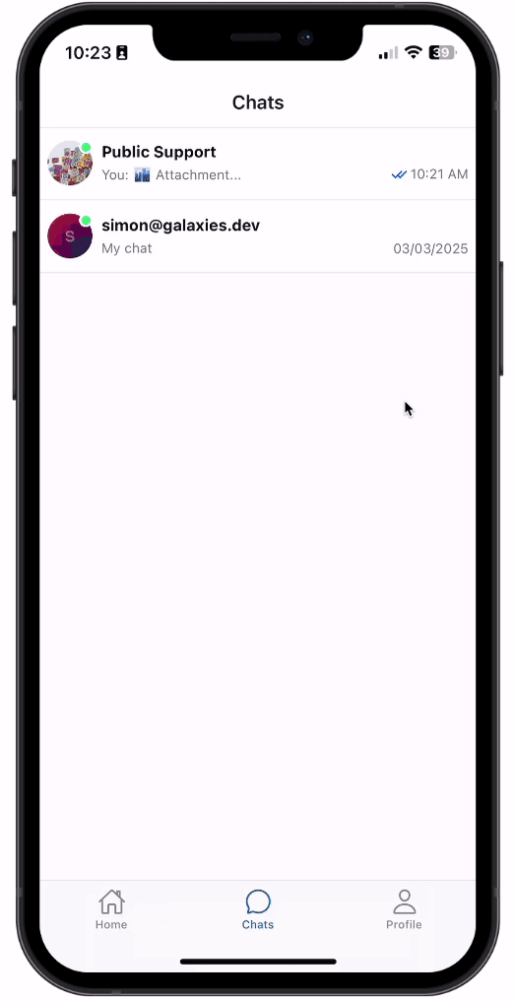
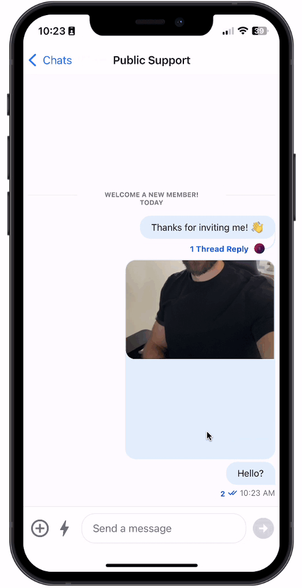

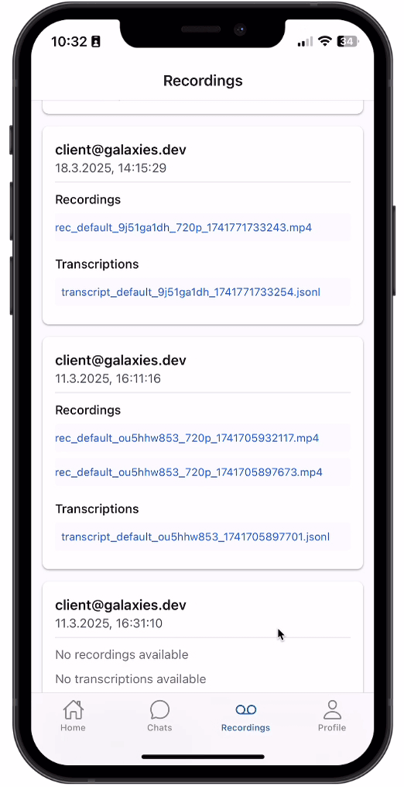
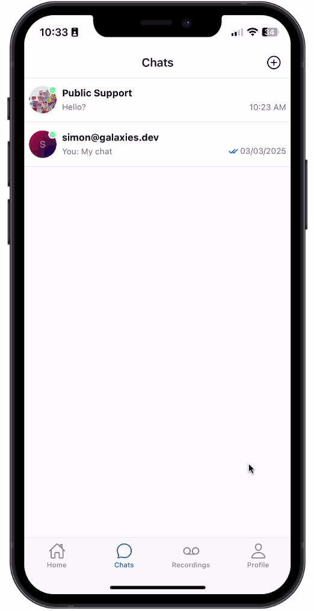

## App Screenshots

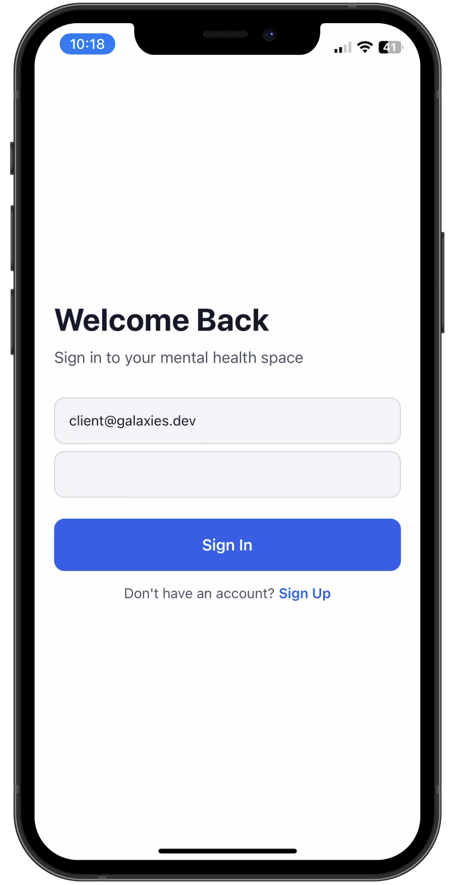
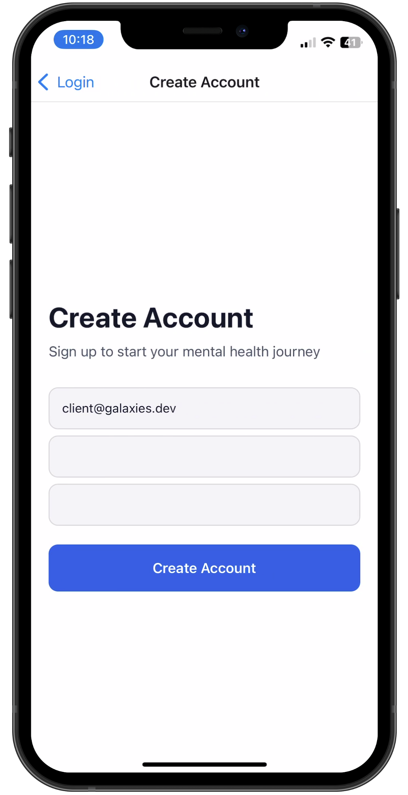
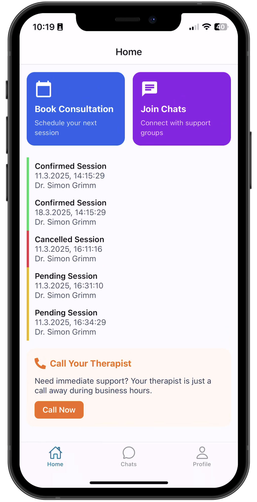
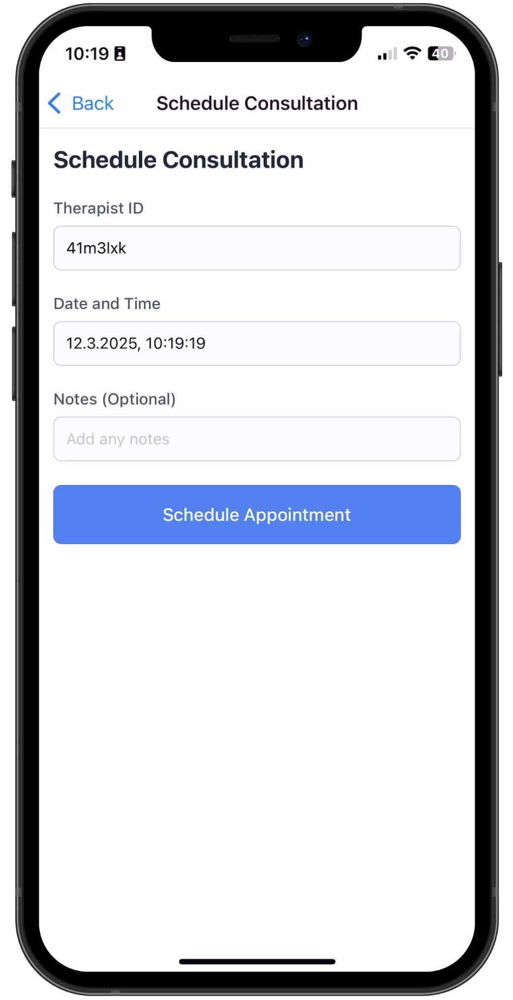
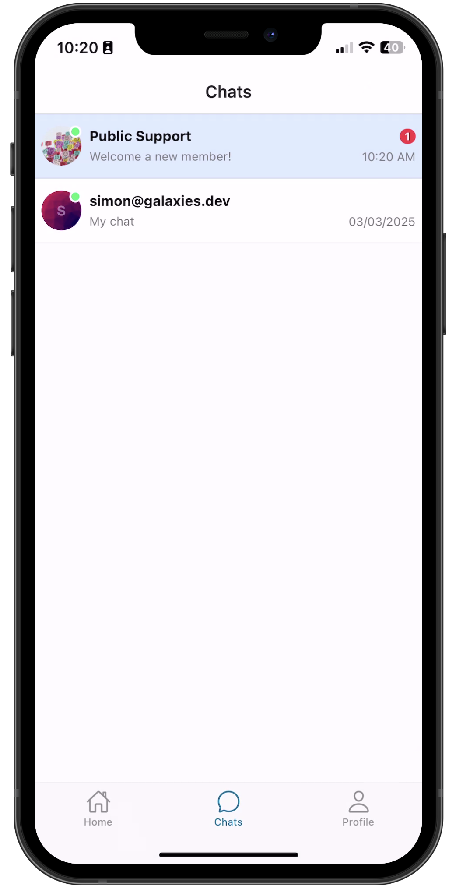
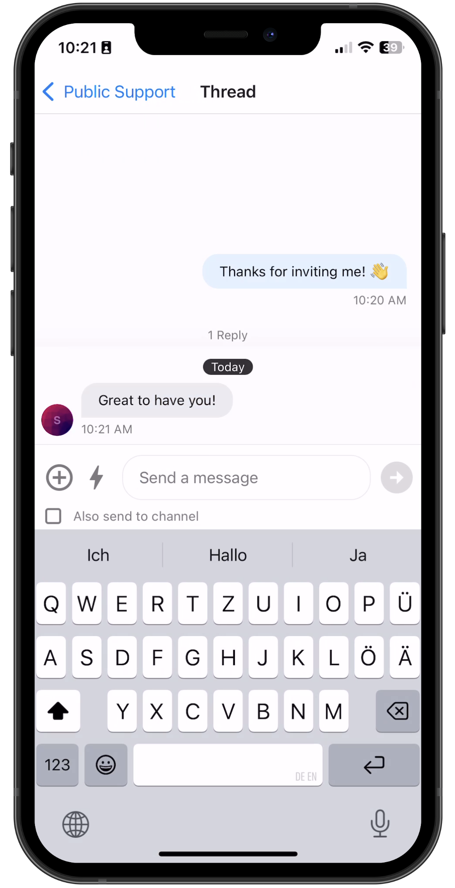
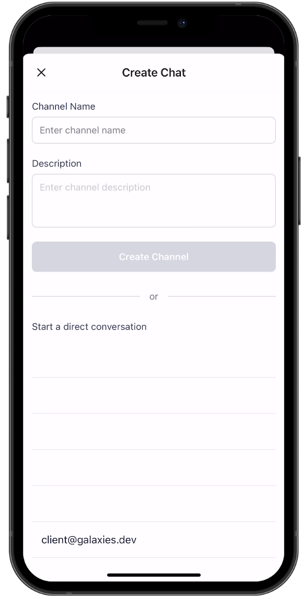

## Stream Screenshots

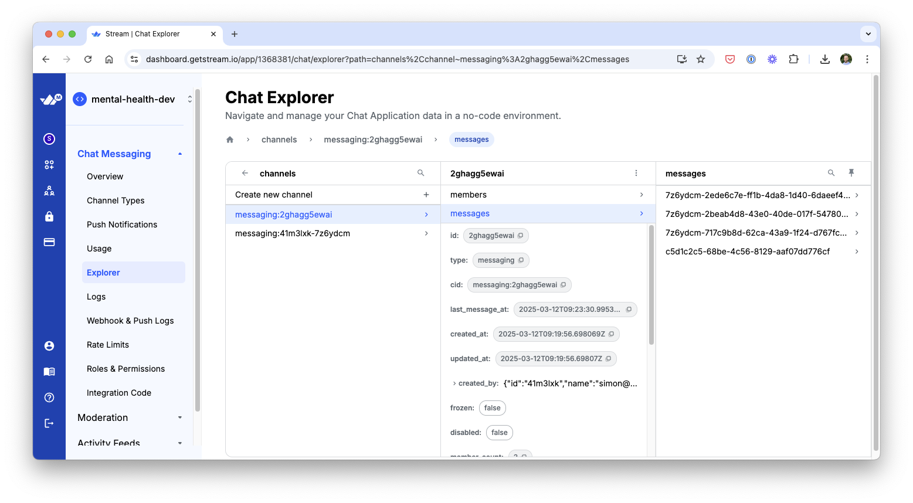
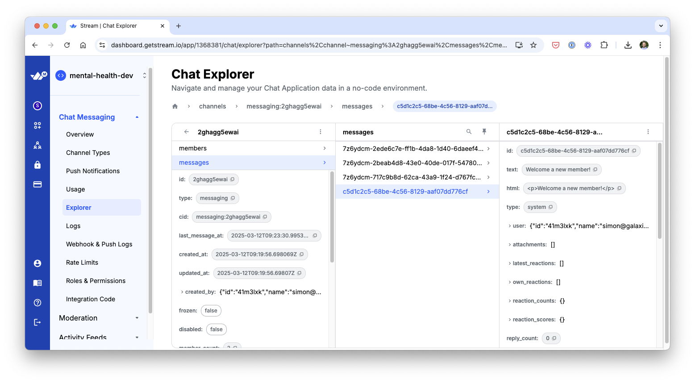
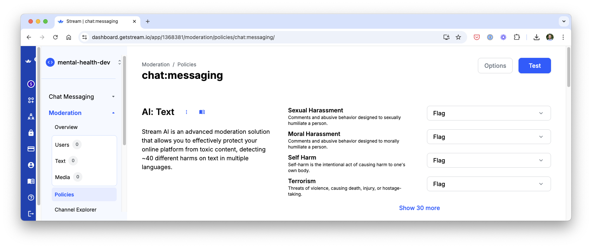
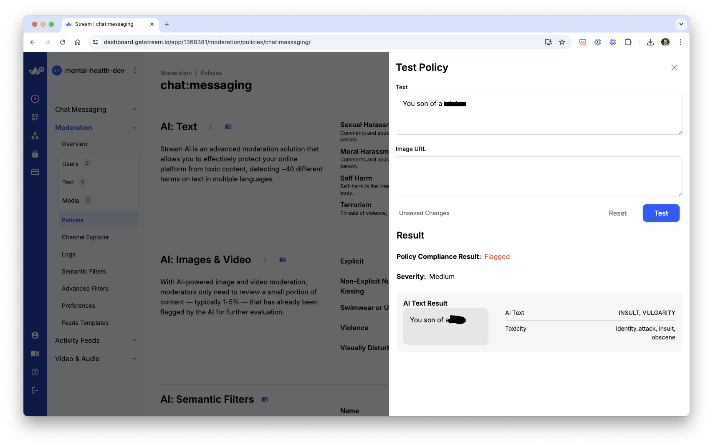

## 🚀 More

**Take a shortcut from web developer to mobile development fluency with guided learning**

Enjoyed this project? Learn to use React Native to build production-ready, native mobile apps for both iOS and Android based on your existing web development skills.

